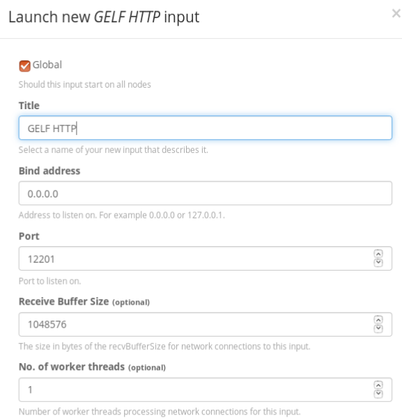
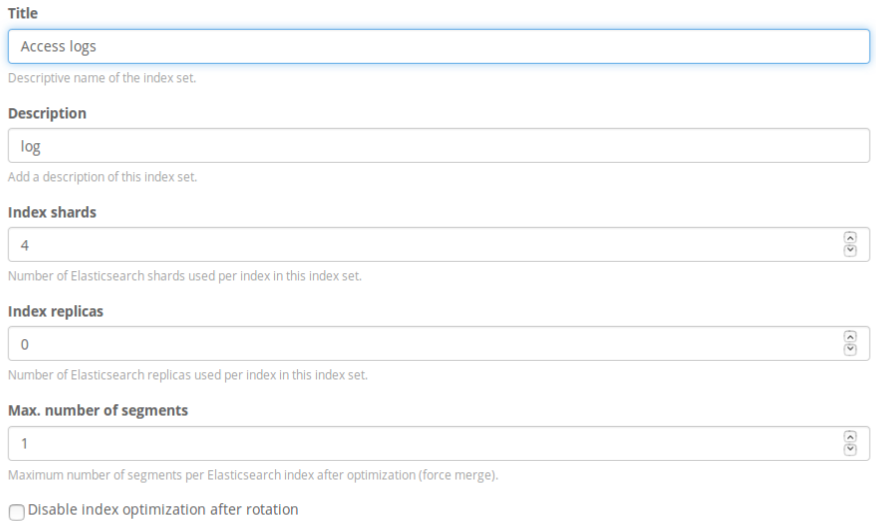
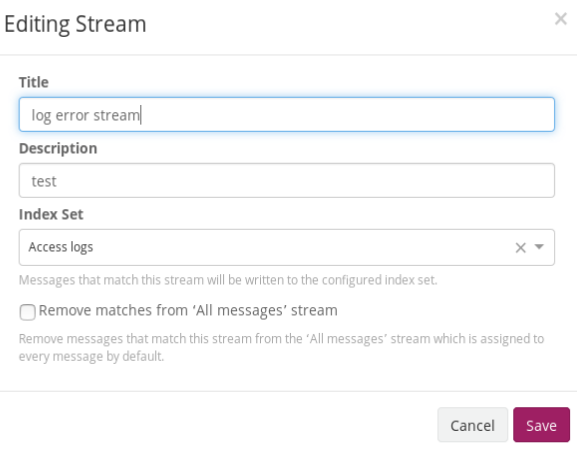
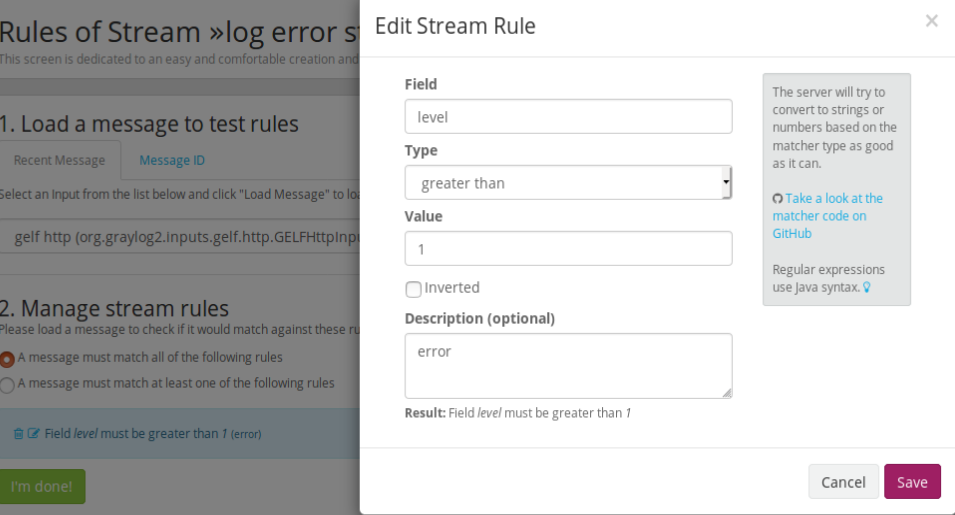
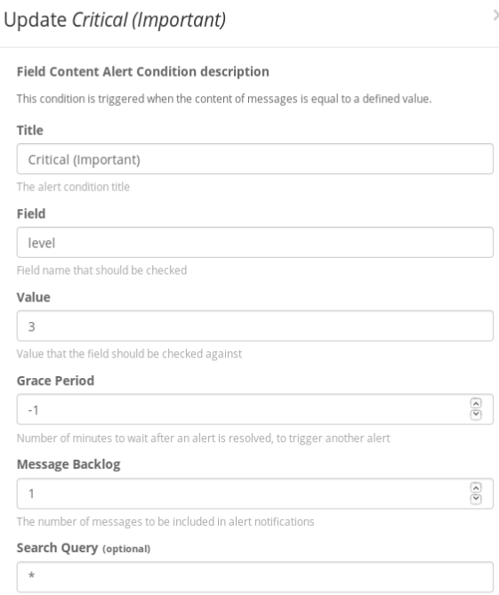
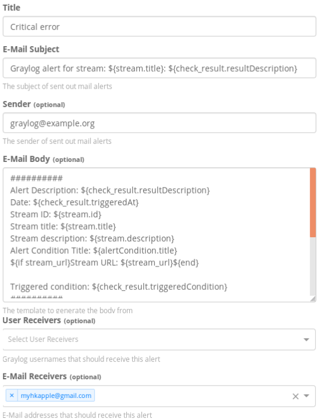
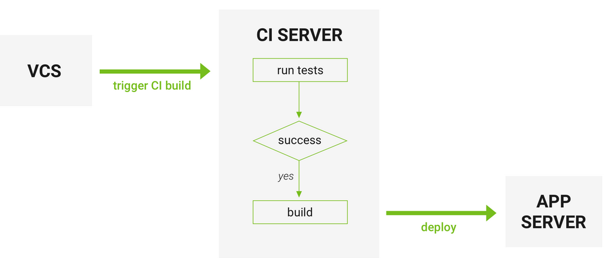
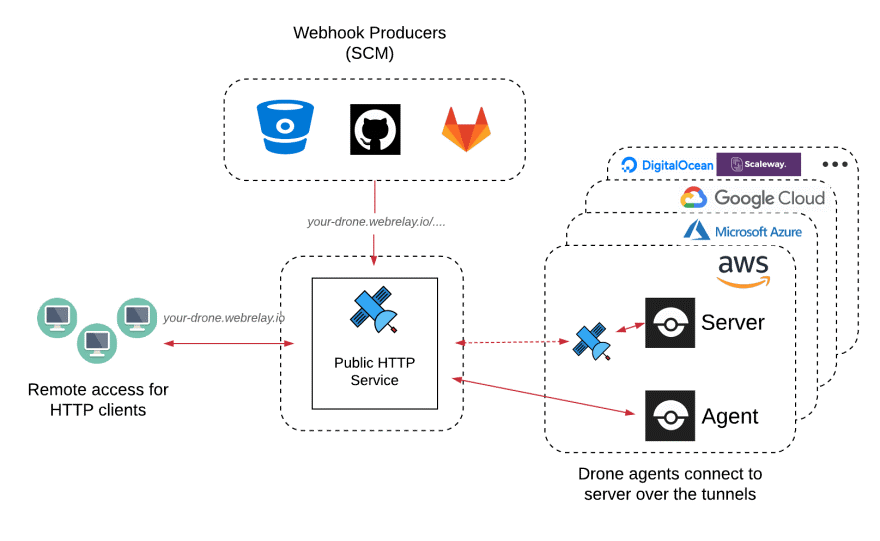
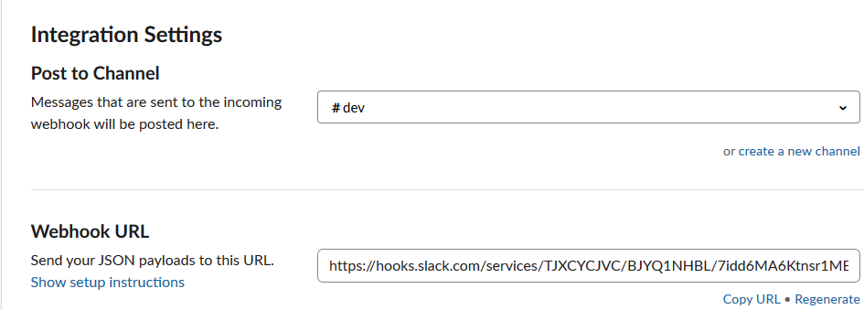

# Docker (Diary / 學習日記)
## docker ecosystem
1. Docker 
2. testing projects (node / python)
3. Logging, e.g. graylog + elasticsearch + MongoDB
4. CI / CD, e.g. Drone
5. Cluster Monitoring, e.g. Kubenetes + Istio
6. Health Check, e.g. CAdvisor + Prometheus + Grafana

## 1. Docker
1. At the beginning, scan official docker doc
2. Install Oracle virtualbox to install Ubuntu to feel what the docker is.
3. install docker-compose in Ubuntu

```
  # install
  sudo wget https://github.com/docker/compose/releases/download/{versionNumber}/docker-compose-Linux-x86_64 -O /usr/local/bin/docker-compose

  # grant permission
  sudo chmod +x /usr/local/bin/docker-compose

  # check installation
  docker-compose –version
```


## 2. Testing projects
use node.js to create websites with Nginx using docker-compose

### Portainer
It is recommended to install portainer for the beginner. 
It provide GUI for managing containers, images volumes over command line that it is easy & convenient to maintain docker environments.
[Portainer installation guide](https://www.portainer.io/installation/)

### Docker-compose environment files
It is better to separate `docker-compose.yml` into multiples based on environment required instead of single one.
By default, Compose reads two files, a `docker-compose.yml` and an optional `docker-compose.override.yml` file. 

For example,
**docker-compose.yml**
```
web:
  image: example/my_web_app:latest
  links:
    - db
    - cache

db:
  image: postgres:latest
```

**docker-compose.override.yml**
```
web:
  build: .
  ports:
    - 8883:80
  environment:
    DEBUG: 'true'

db:
  command: '-d'
  ports:
    - 5432:5432
```

To deploy with this production Compose file you can run
```
docker-compose -f docker-compose.yml -f docker-compose.prod.yml up -d
```

*** Nginx
For me, its main propose is to pretend to run nodejs cluster & balance workload (一個 Nginx server 跟幾個 web server)

Preparations:
make a server using `app.js`
```
const fastify = require('fastify')();

const { PORT } = process.env;

fastify.get('/', (req, reply) => {
  console.log('process pid =>', process.pid);
  reply.send('Hello World, great!');
});

fastify.listen(PORT, err => {
  if (err) throw err;
  console.log('Server listening on port ' + PORT);
});
```

`Dockerfile`
```
FROM node:12.2.0-alpine

USER root

<!--- it is addgroup & adduser, NOT groupadd & useradd in Linux -->
RUN addgroup -S docker \
	&& adduser -S nodejs docker

WORKDIR ./website

COPY ./website .

RUN npm install

USER app

CMD ["npm", "run", "start"]
```

`docker-compose.yml`
```
version: '3'
services:
  nginx:
    image: nginx:1.16.0-alpine
    container_name: webserver
    depends_on:
      - website1
      - website2

  website1:
    build: ./
    container_name: website1

  website2:
    build: ./
    container_name: website2
```

`docker-compose.dev.yml` \
Create a common network for containers' communication
```
version: '3'
services:
  nginx:
    volumes:
      - ./nginx/default.conf:/etc/nginx/conf.d/default.conf
      - ./nginx/log:/var/log/nginx
      - /etc/localtime:/etc/localtime:ro
    restart: always
    ports:
      - 8080:80
    networks:
      web:

  website1:
    restart: always
    environment:
      - PORT=8081
    networks:
      web:

  website2:
    restart: always
    environment:
      - PORT=8082
    networks:
      web:

networks:
  web:
```

`.dockerignore` \
it is used to prevent unneccesary installation packages clone into image
```
node_modules
npm-debug.log
```

`nginx.conf` \
**upstream** defines a group of servers to listen
```
upstream node_cluster {
  server website1:8080;
  server website2:8081;
}

server {
    listen 80 default_server;
    listen [::]:80 default_server;
    server_name localhost;
    server_tokens off;
    client_max_body_size 15M;

    if ($http_x_forwarded_proto = "http") {
	return 301 https://$host$request_uri;
    }

    location / {
	proxy_set_header X-Real-IP $remote_addr;
	proxy_set_header X-Forwarded-For $proxy_add_x_forwarded_for;
	proxy_set_header Host $http_host;
	proxy_set_header X-NginX-Proxy true;

	proxy_pass http://node_cluster;
	proxy_redirect off;
    }
}
```
## 3. Logging
### Installation 
[Graylog installation guide on docker](http://docs.graylog.org/en/3.0/pages/installation/docker.html) \
Advantages of graylog over ELK
- less complicate setup, fit for beginner
- have its own built-in dashboard & friendly UI
- monitor data and send alerts


### How to get message into Graylog
1. Properly map port in container
  You have to config port mapping in docker-compose file, otherwise data will not go through.

  For example, to start a GELF TCP input on port 12201, stop your container and recreate it, while appending -p 12201: 12201 to your docker run command.

  start a GELF UDP input on port 1514, stop your container and recreate it, while appending -p 1514: 1514/udp to your docker run command.

2. GELF HTTP \
  input command 
  ```
  curl -XPOST http://0.0.0.0:12201/gelf -p0 -d '{"message":"这是一条消息", "host":"172.3.3.3", "facility":"test", "topic": "meme"}'
  ```

### Send Message to Graylog
1. login into Graylog

2.	Create an Input that log can be sent in, e.g. “Gelf Http”
<p>
  
</p>

3.	Create Index Set, e.g. “Access Log”
<p>
  
</p>

4.	Create New Stream “Log Error Stream” include index set named “Access Log”
<p>
  
</p>

5. 	Add Stream Rule that include an Input with “Gelf Http” & Field “level” match exactly “3”. Click I’m done.
<p>
  
</p>

6. 	Stream / Manage Alert, Create new Notification for Alerts. Then Create new Condition / Notification.
<p>
  
</p>

7. Set up email template
<p>
  
</p>

### Send email via gmail SMTP
It is easy to setup if follow guide. Or you can enable to send email by gmail SMTP.

1. You can add the following lines in environment in graylog section
```
environment:
  - GRAYLOG_TRANSPORT_EMAIL_ENABLED=true
  - GRAYLOG_TRANSPORT_EMAIL_HOSTNAME=smtp.gmail.com
  - GRAYLOG_TRANSPORT_EMAIL_PORT=587
  - GRAYLOG_TRANSPORT_EMAIL_USE_AUTH=true
  - GRAYLOG_TRANSPORT_EMAIL_USE_TLS=true
  - GRAYLOG_TRANSPORT_EMAIL_USE_SSL=false
  - GRAYLOG_TRANSPORT_EMAIL_AUTH_USERNAME=gmailAccount
  - GRAYLOG_TRANSPORT_EMAIL_AUTH_PASSWORD=gmailPasword
```

2. Click on the Forwarding/IMAP tab and scroll down to the IMAP Access section: 
IMAP must be **enabled** in order for emails to be properly copied to your sent folder.

3. If not successful, just follow the steps [Lower security of gmail a/c / 允許低安全性應用程式的存取權](https://github.com/matomo-org/matomo/issues/8613)
-	前往您的 Google 帳戶
-	按一下左側導覽面板上的 [安全性]
-	在頁面底部的「低安全性應用程式存取權」面板上，按一下 [開啟存取權]


## 4. CI/CD (Drone)
<p>

</p>

CI/CD:
1. Continue to **test** every change.
2. Continue to **build** every change.
3. Continue to **deploy** every change.

### What is Drone? [Drone CI Doc](https://docs.drone.io/)
Drone is a Continuous Delivery system built on container technology. \
Drone uses a simple **YAML** configuration file, a superset of docker-compose, to define and execute Pipelines inside Docker containers.

**Pros:**
- easy to setup
- simple to use & define pipeline using yaml format
- faster building time beacuse container native
- be able to integrate with Github & other self-hosting software, e.g. Gitea, GitLab, Gogs, Gitbucket.

**Cons:**
- imcomprehensive documentation
- small community
- less plugins provided, but you can write by yourself

### CI / CD process:
<p>

</p>

Drone consists of 2 components: \
-	Server: responsible for authentication, repository configuration, users, secrets and accepting webhooks. 
-	Agent: receive build jobs and actually run your workflows.

### installation
**docker-compose.yml**
version: "3"

services:
  drone-server:
    image: drone/drone:1.1
    container_name: drone-server
    ports:
      - 8000:80
      - 8009:9000
    volumes:
      - /var/lib/drone:/data
    restart: always
    environment:
      - DRONE_DEBUG=true
      - DRONE_HOST=http://drone-server:8000
      - DRONE_GITHUB_SERVER=https://github.com
      - DRONE_GITHUB_CLIENT_ID={}
      - DRONE_GITHUB_CLIENT_SECRET={}
      - DRONE_RUNNER_CAPACITY=2
      - DRONE_SECRET=secret
      - DRONE_USER_CREATE=username:{github_username},admin:true
      - DRONE_SERVER_PROTO=http
    networks:
      - appnet

  drone-agent:
    image: drone/agent:1.1
    container_name: drone-agent
    command: agent
    restart: always
    depends_on:
      - drone-server
    volumes:
      - /var/run/docker.sock:/var/run/docker.sock
    environment:
      - DRONE_DEBUG=true
      - DRONE_SERVER=http://drone-server:9000
      - DRONE_SECRET=secret
    networks:
      - appnet

networks:
  appnet:


### How to communicate with Github
Go to Personal account -> \
Settings -> \
developer settings -> \
OAuth Apps -> \
Register a new application -> \ 
Fill in 'application name', 'authorization callback url' (must be public domain) -> \ 
In the same page, find 'Client ID' & 'Client Secret'

## Installation Drone CLI
First, type the following cmd in terminal. \
  curl http://downloads.drone.io/release/linux/amd64/drone.tar.gz | tar zx \
  sudo install -t /usr/local/bin drone \

In order to interact with the server using REST endpoints in command line tool, add your 'Drone Server URL' & 'Personan Access Token' from Drone Web UI in terminal \
export DRONE_SERVER=你的Drone Server URL
export DRONE_TOKEN=你的Personan Access Token

### Environment variables
tag_vsersion in package.json can be used for the image built publishing for docker hub. \
Print  ${tag_version} in bash

### Secrets
You can hide you sensitive info by using secret function in Drone. \
Open Drone Web UI, input key/value, e.g. password/abc123, so the Drone can use this secret when executing CI.

## Pipeline 流程
**.drone.yml**
```
kind: pipeline
name: deploy

steps:
  - name: unit-test
    image: node:12.2.0-alpine
    commands:
      - npm install
      - npm run lint
      - npm run test
    when:
      branch:
        include:
          - feature/*
          - master
          - develop
      event:
        include:
          - push
          - pull_request         
```

### use cache to boost building time (引入緩存減少重復下載)
**Volume Cache**
```
steps:
- name: restore-cache
  image: drillster/drone-volume-cache
  volumes:
  - name: cache
    path: /cache
  settings:
    restore: true
    mount:
      - ./node_modules

- name: rebuild-cache
  image: drillster/drone-volume-cache
  volumes:
  - name: cache
    path: /cache
  settings:
    rebuild: true
    mount:
      - ./node_modules

volumes:
  - name: cache
    host: 
      path: /tmp/cache
```

### How to build custom tag
**pipeline**
```
  - name: get-tag-no
    image: alpine
    env_file:
      - ./env/build.env
    commands:
      - sh ./scripts/build-tag.sh
```

**build-tag.sh**
Get tag no. from package.json
```
version=$(cat package.json \
    | grep version \
    | head -1 \
    | awk -F: '{ print $2 }' \
    | sed 's/[",]//g' \
    | tr -d '[[:space:]]')
echo "Current Version, $version" #variable
echo -n "${version}" > .tags
```

### Create Image & publish to Docker Hub
When testings are done, the next step is to publish the latest image built to docker hub for later deployment

**Dockerfile**
```
FROM node:12.2.0-alpine #use alpine to minimize the image size
WORKDIR /usr/ci-test
COPY . .
RUN npm install
EXPOSE 8100
CMD ["npm", "run", "start"]
```

**Inside pipeline**
```
  - name: publish-test-image
    image: plugins/docker
    settings:
      repo: docker.io/myhk2009/docker-ci  #private image: add docker.io
      registry: docker.io # image host for pulling
      username:
        from_secret: DOCKER_USERNAME   # docker hub a/c
      password:
        from_secret: DOCKER_PASSWORD
    when:
      branch: feature/*
      event: 
        include:
          - push      
          - pull_request
```

### Create Deployment script
**use git to download to host by Drone Agent & create script to replace new image**

接著要在系統內建置要用來執行的 shell script，請在 terminal 內輸入以下指令：
```
vim deploy.sh
```

並輸入以下內容：
```
#!/bin/bash
echo "Updating staging Server"
echo "stopping projectName.service"
sudo systemctl stop projectName.service

# remove all outdated images and containers
echo "removing outdated/dangling images and containers"
docker stop container_name
docker rm container_name

#remove all-related & dangling images
docker images | grep "^{image}" | awk '{print $1 ":" $2}' | xargs docker rmi

# create new image for projectName
echo "create new image for projectName"
cd /home/stu60610/projectName
git pull origin develop/master
docker build -t=”{containerName}” . 

# restart service which will use the newly pulled image
echo “restarting projectName service”
systemctl start projectName.service

# App is updated!
echo “projectName successfuly updated!”

Be able to exec in non-root user, type the following cmd
$ sudo chmod +x deploy.sh
```

### Slack Notification from Drone
1. Setup slack workspace
- Username: abc
- Channel: dev
- Webhook: webhook-url-from-slack

2. Choose the channel you want to send message from drone

3. Find 'integration settings' -> 'webhook url'
<p>

</p>

4. copy & paste the webhook url into slack settings in .drone.yml
Every time you trigger Drone CI, there will be an notification about success / fail in the slack
